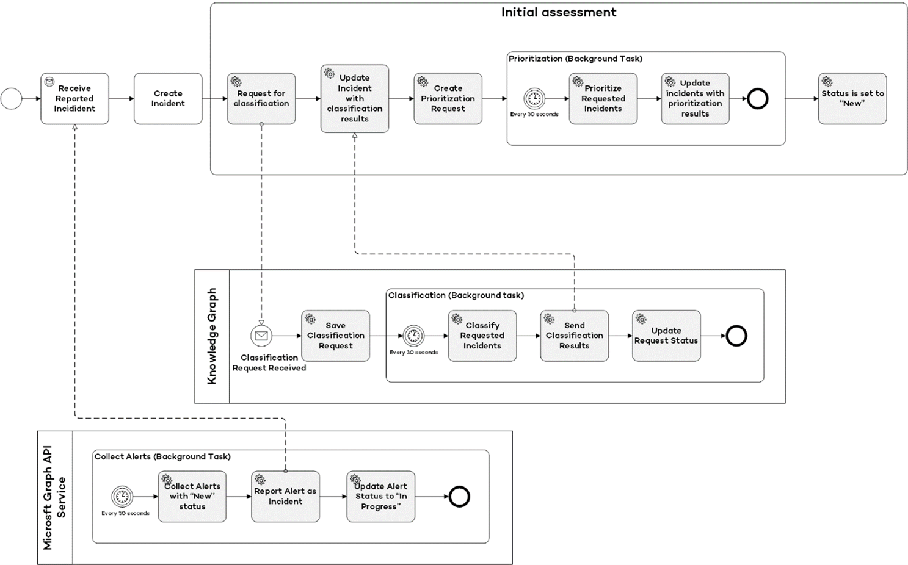
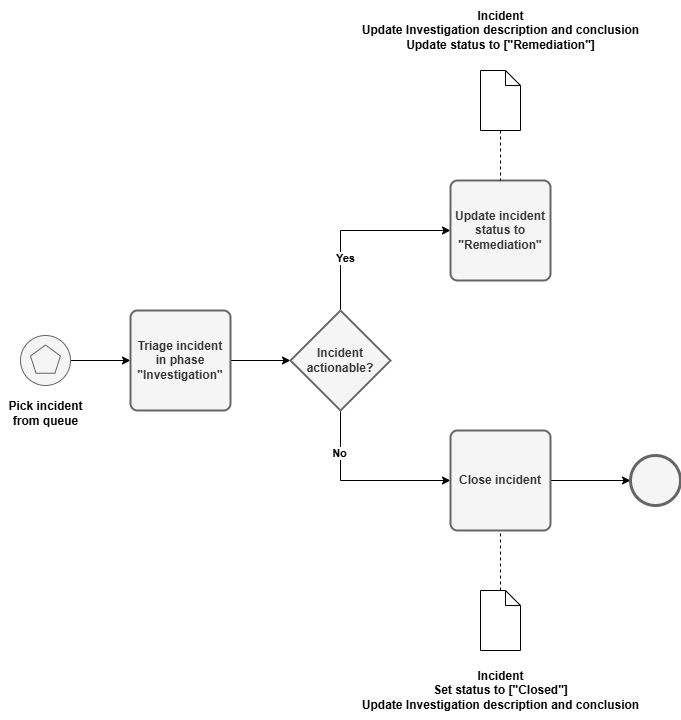
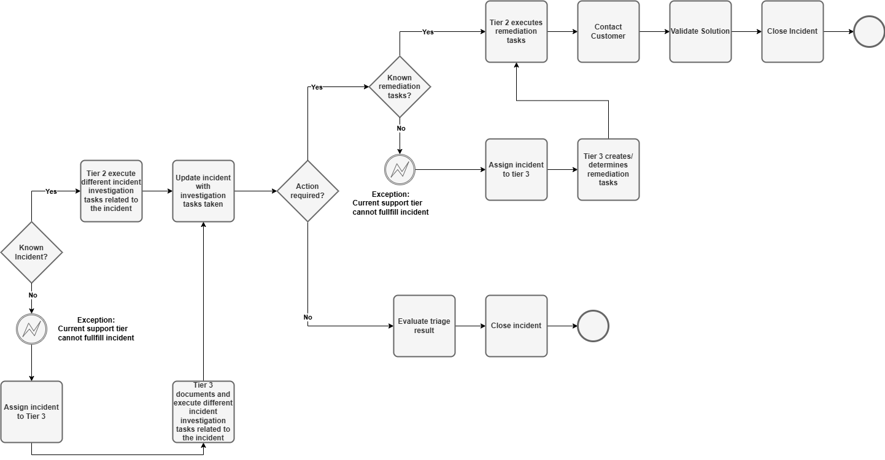
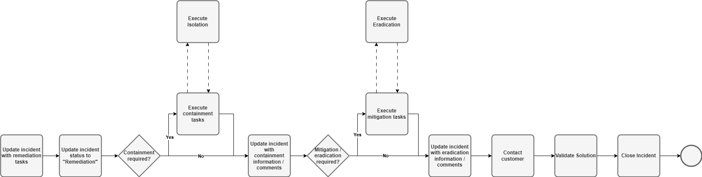
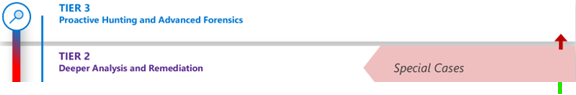
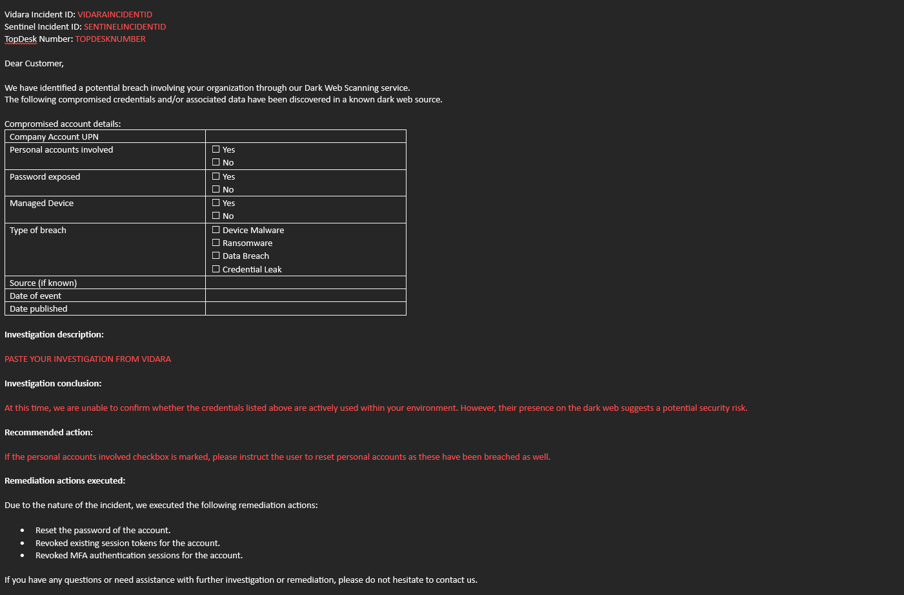

## Introduction ##

To identify, analyze, and determine an organizational response to cybersecurity incidents, a proper incident management should be in place. Incident management is, according to ITIL, the process of managing service disruptions and restoring services within agreed service level agreements (SLAs). In addition, it covers every aspect of an incident across its life cycle.

## Dark Web Incident Lifecycle ##

Wortell has established a standard procedure for the incident management process. Incidents related to darkweb threats follow a structured lifecycle to ensure efficient triage, investigation, and remediation. The stages are as follows:

- **New** - An incident that has been logged but not yet triaged.
An incident can be logged through a phone call, email or recording by Vidara. Once an incident is generated in the source system, it will go through initial intake. During this intakes, the following action take place:
- **Field based prioritization** - Based on certain values of fields, a priority can get assigned to an incident: Critical, High, Medium. The Low and Informational will be handled and reviewed in the portal.
- **Investigation** - An incident that is classified as a **True Positive**  that requires deeper analysis.
During this phase:
Additional data is collected (e.g., threat intelligence, indicators of compromise from the dark web, internal logs).
For known incident types, predefined investigation procedures are followed.
If no standard procedure exists, the incident is escalated to a Tier 3 Analyst to:
  - Define and execute custom investigation tasks.
  - Assess the impact and determine if remediation is necessary.
- **Remediation** - An incident that demands active response and mitigation.
For known incidents, an instruction to fulfill the remediation task(s) is available. If no such instruction is available for this type of incident, escalation to a **Tier 3 analyst** will take place. This analyst adds the required tasks and executes them. The tasks include:
  - Isolating affected systems or resources.
  - Mitigating the identified threat (e.g., blocking compromised accounts, blacklisting dark web domains, resetting credentials).
  - Collecting evidence for forensic purposes.
  - For critical incidents, initiating crisis communication protocols to keep stakeholders informed during remediation.
  If no standard remediation process exists for the incident type, a Tier 3 Analyst will define and execute the required tasks.
- **Closed** - An incident that was closed once the resolution was acknowledged by the customer. Wortell is able to close without customer validation if:
  - The incident is resolved during triage (false positive, duplicate, etc.).
  - The incident is resolved during investigation without requiring further action.

## Incident Management Proces ##

Below is a depiction of the incident management phases along with their corresponding actions.

### Initial Intake ##

Each incident that will be handled by Wortell Managed Detection and Response undergoes an intake. This intake process is used to prioritize an incident and enrich it with the required information for an MDR engineer to be analysed.

### Triage ##

After the initial intake, the incident undergoes triage. As part of the triage process, "actionable" incidents are filtered from the "non-actionable" incidents.

After triaging, each incident will have a triage result. Depending on the triage result, an incident will get investigated or not. The following triage results are available:

| Triage Result | Triage Reason | Needs investigation |
| ------------- | --------------| ------------------- |
| True Positive | Suspicious activity or a malicious action is seen | Yes |
| Benign Positive | Suspicious activity that is expected or explainable | No |
| False Positive (Incorrect alert logic) | Incident created based on wrong alert logic | No |
| False Positive (Inaccurate data) | Incidents that are out of scope of made obsolete by later occurred logs | No |
| Undetermined | Duplicate incidents or informational notifications | No |

### Investigation ###

When an incident is triaged as "True Positive" it needs to be investigated. The goal of the investigation is to create a plan for the mitigation of this incident.

### Remediation ###

After investigation the incident will get remediated. One or multiple remediation activities will get executed to contain and mitigate the incident. Activities to think of:

- Disable user account
- Reset user password
- Isolate a machine
- Block an IP Address

## Support Tiers ##

Responding to incidents within agreed service level agreements is meant to support incident management that is used by security operations centers (SOC) and in Wortell’s own Cyber Defence Center by their Managed Detect and Response department. Incident Management sits within and across any response process, ensuring all stages are handled.

Wortell MDR uses a tiered model for handling different types of incidents. This model consists out of 2 following tiers of incidents related to DarkWeb:

- Tier 2
- Tier 3

### Tier 2 ###

These are incidents that require more technical knowledge, attention or time in order to remediate them and have the following characteristics

- The incident from DarkWeb are always Tier 2 actions
- These incidents require deep investigation to remediate.
- Is a customer request
- An action is required in the customer environment

### Tier 3 ###

Tier 3 is a support tier that is being used for:

- The improvement of detection rules
- Execute vulnerability management
- Execute threat hunting sessions

### Communication flow ###

Customer Communication Process for Security Incidents

When communication with the customer is required, we will use our standard email template to ensure consistency, clarity, and compliance with data privacy policies.

The email template will include the following reference information:

- Vidara Incident ID: VIDARAINCIDENTID

- Sentinel Incident ID: SENTINELINCIDENTID

- TopDesk Number: TOPDESKNUMBER

In accordance with our privacy standards, we will not share any personal information related to individual users or personal accounts. The customer will only be informed about incidents involving company accounts or company-managed devices.

- The template will also include key details of the incident:
- Personal accounts involved: ☐ Yes ☐ No
- Password exposed: ☐ Yes ☐ No
- Managed device involved: ☐ Yes ☐ No
- Type of breach:
☐ Device Malware
☐ Ransomware
☐ Data Breach
☐ Credential Leak
- Source (if known):
- Date of event:
- Date published (if applicable):

A clear and concise investigation description will be provided, outlining the findings and the conclusion of our analysis.

Additionally, the communication will include:

Recommended actions that the customer should take.

Actions required if MDR (Managed Detection and Response) services cannot proceed without customer involvement.

This ensures the customer is properly informed and equipped to take any necessary steps to mitigate risks and protect their environment.

