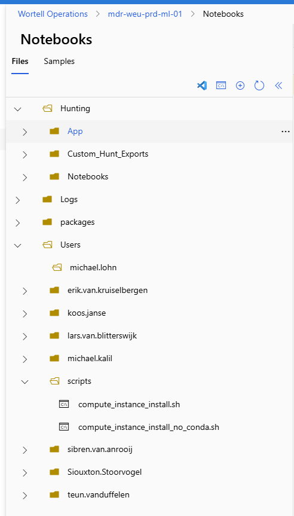

## Document Classification

This document is only for internal use of Wortell Managed Detection and Response.

## Introduction

This article describes how to configure your notebook and run hunting cases.

The Hunting Team will request a hunting notebook from the Development Team on your behalf. Once the notebook has been delivered, you can follow the steps below to configure it properly.

## installing the vidara script

Go to the following website [Azure AI | Machine Studio](https://ml.azure.com/fileexplorerAzNB?wsid=/subscriptions/425e0378-1f3a-4672-9c74-d071787fe335/resourcegroups/mdr-weu-prd-hunting-01/providers/Microsoft.MachineLearningServices/workspaces/mdr-weu-prd-ml-01&tid=3047d88e-63ee-4341-83a3-3086c6230826)

To ensure you can connect to Vidara and request the necessary tokens for running the hunts, it is important to run the following script.

* compute_instance_install_no_conda.sh

The script can be found in the following location.

Right-click on the name of the script and select “Run Script in Terminal.”
This action will initiate the installation of the Vidara package in your compute environment.
Once the installation is complete, you can proceed with installing the S.T.R.I.K.E module.

## Strike Module installation

When you are signed in to your ML workspace and connected to your compute environment, navigate to the Notebooks tab in the portal.
There, you will find a document named README_STRIKE.md.

Please follow this article carefully to ensure that you install the S.T.R.I.K.E module correctly.

Any questions please contact the hunting team.
